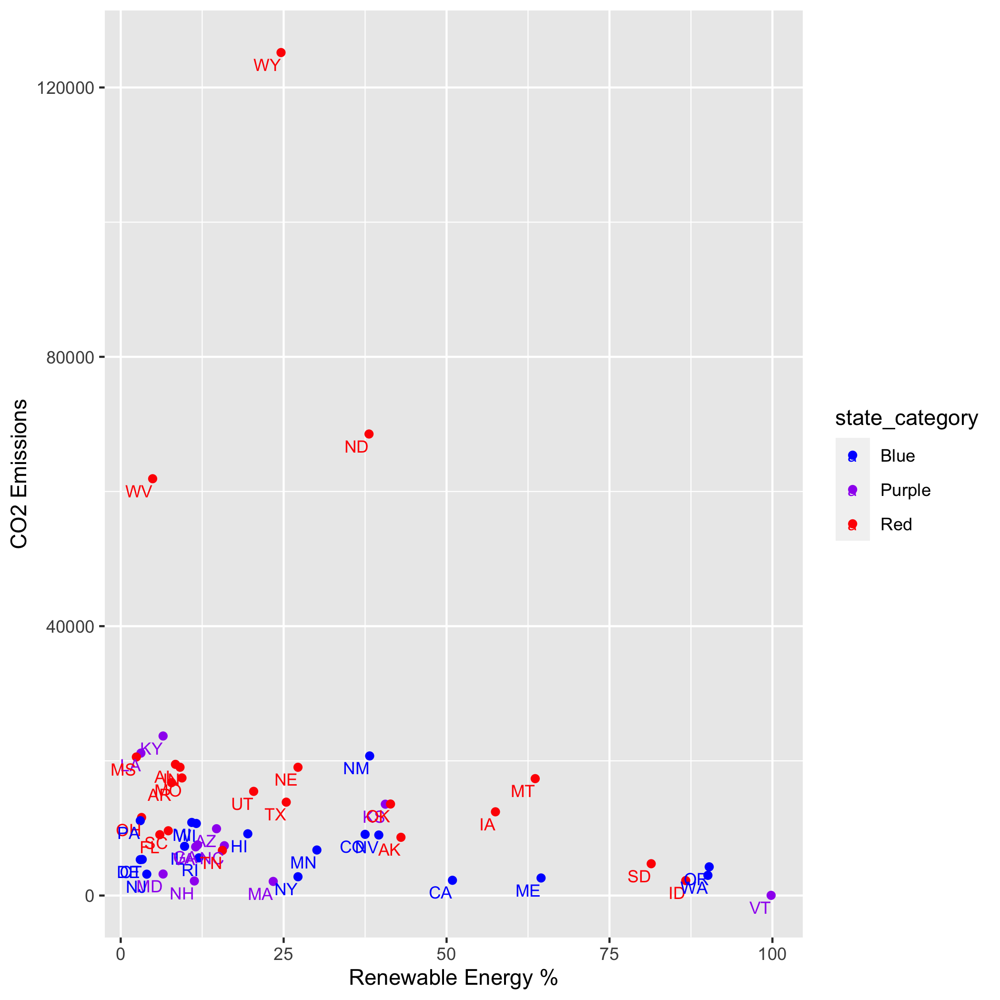

name: toc

```{css, echo=FALSE}
# CSS for including pauses in printed PDF output (see bottom of lecture)
@media print {
  .has-continuation {
    display: block !important;
  }
}
.small {
  font-size: 90%;
}
.smaller {
  font-size: 80%;
}

```

```{r setup, include=FALSE}
options(htmltools.dir.version = FALSE)
library(knitr)
knitr::opts_chunk$set(
	fig.align = "center",
	cache = T,
	dpi = 300
)
opts_knit$set(root.dir = "/Users/nathanbush/Documents/GitHub/Data Analytics Term Project")

load("~/Documents/GitHub/Data Analytics Term Project/Relevant Files/graph_5.0.Rdata")
load("~/Documents/GitHub/Data Analytics Term Project/Relevant Files/energy_map.Rdata")
load("~/Documents/GitHub/Data Analytics Term Project/Relevant Files/affiliation_map.Rdata")
load("~/Documents/GitHub/Data Analytics Term Project/Relevant Files/graph_6.Rdata")
load("~/Documents/GitHub/Data Analytics Term Project/Relevant Files/graph_6.0.Rdata")
load("~/Documents/GitHub/Data Analytics Term Project/Relevant Files/graph_6.0.1.Rdata")
load("~/Documents/GitHub/Data Analytics Term Project/Relevant Files/dot_plot.Rdata")
load("~/Documents/GitHub/Data Analytics Term Project/Relevant Files/dot_plot_2.Rdata")
load("~/Documents/GitHub/Data Analytics Term Project/Relevant Files/graph_1_color.Rdata")
library(ggplot2)
ggsave(
  filename = "graph_5.0.png",
  plot = graph_5.0)
ggsave(
  filename = "graph_6.png",
  plot = graph_6)
ggsave(
  filename = "graph_6.0.png",
  plot = graph_6.0)
ggsave(
  filename = "graph_6.0.1.png",
  plot = graph_6.0.1)
ggsave(
  filename = "dot_plot.png",
  plot = dot_plot)
ggsave(
  filename = "dot_plot_2.png",
  plot = dot_plot_2)
ggsave(
  filename = "graph_1_color.png",
  plot = graph_1_color)
```


# Introduction


**Potential Topics**
- Fish populations in the Salmon river 
- National Park visitation and Social Media

<br>


**Motivation**
- Curious about state politics & how it effects decision making
- Energy is a good metric to measure this 
- Interesting independently 

<br>

**Hypothesis**
- Conservative states use less energy than is optimal


---

# Why is this important?

  - Do state politics interfere with decision making?
  
  <br>
    
  - Are states acting in their own best interest?
   
  <br>
  
    
  - Understand these dynamics to best inform policy
    
---

# Data

**Energy usage statistics by state**
       - US Energy Information Administration
        
        
        
**2000-2020 presidential election data**
        - MIT Election and Data Science Lab & the Harvard Dataverse 
        
        
        
**2022 State Governors** 
        - Webscraped from Wikipedia
---

# Data Cleaning Process

**Energy Use Data**
- This dataset needed the most work
- Removed rows containing non-data entries
- Removed variables unnecessary to my analysis
- Applied transformations to key variables 
    - (* = 0 | --, NM = N/A)

**Election Data**
- Clean Dataset...tricky variable creation
- Summed votes for candidates within states to determine victor
- Dummy variable = 1 if a state voted for Trump

**Governor Data**
- Webscraped Wikipedia Table
- Easy to clean and process
- Dummy variable = 1 if a state has a republican governor

---

# Question 1

**Are there discernible differences between renewable energy use based on political affiliation between states?**

Three Categories

- **Red** 
  - Voted for Trump in 2020
  - Republican Governor
    
- **Blue**
  - Voted for Biden in 2020
  - Democratic Governor
    
- **Purple**
   - One and not the other
---
class: inverse, middle
name: cases

# Overview
---
# Map of State Political Category
```{r, out.width="100%", echo=F, eval = TRUE}

```
---
# Renewable Energy by Political Category
```{r, echo=F, eval=TRUE}

```
---
# Renewable Energy (%) by State
```{r, out.width="100%", echo=F}

```
---
# Analysis


  - **Trends**
  <br>
  
  - **Outliers**
  <br>
  
  - **Notable patterns**
---
# Renewable Energy by State
```{r, echo=F, eval=TRUE}

```
---
# Renewable Energy by Political Category
```{r, out.height="100%", echo=F}

```
---
# Comparisons

 - Now, I want to compare CO2 emissions to the amount of renewable energy states generate
---
# Version 1
```{r, out.width="100%", echo=F}

```
---
# Version 2
```{r, out.width="100%", echo=F}

```
---
# Version 3
```{r, out.width="100%", echo=F}

```
---
# Takeaways

  - Texas is the biggest polluter in the US.
  
  <br>
  
  - Three states emit more than their fair share.
  
  <br>
  
  - Important to transform data when necessary.
---
class: inverse, middle
name: dplyr

# Are states acting rationally?
---
```{r, out.width="100%", echo=F}

```


